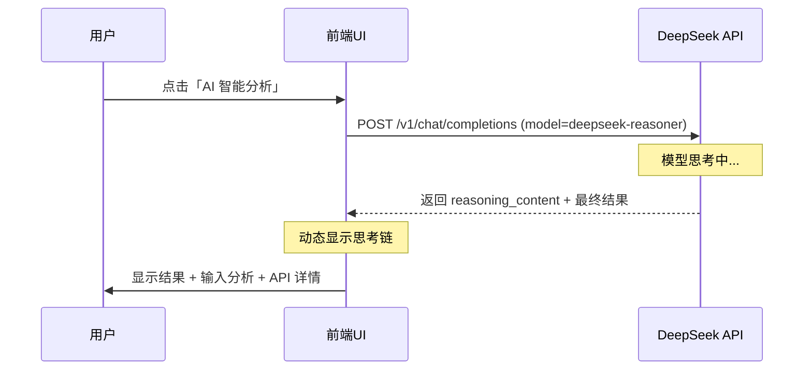

## 用户需求

1. 使用 DeepSeek 推理模型（deepseek-reasoner），并在 UI 上显示其思考链（reasoning_content）
2. 在结果面板显示 API 响应详情：模型名称、Token 使用量、响应时间
3. 让 AI 在返回结果时额外返回「用户输入分析」字段，说明它从用户输入中提取了哪些关键信息

## 功能内容

- 切换 AI 模型从 `deepseek-chat` 到 `deepseek-reasoner`
- 在加载动画区动态展示模型思考链（逐段显示）
- 在结果面板新增「AI 如何理解你的需求」区域
- 在结果面板新增「API 调用详情」区域（模型、Token、响应时间）
- 修改 system prompt 使 AI 返回 `input_analysis` 字段
- 修改 `callDeepSeekAPI()` 提取 `reasoning_content` 和 `usage` 数据

## 技术栈

- 前端：原生 HTML/CSS/JavaScript（无框架）
- AI 模型：DeepSeek Reasoner（`deepseek-reasoner`）
- API 通信：原生 `fetch` + `AbortController` 超时控制

## 实施方案

### 1. 模型切换与思考链显示

DeepSeek Reasoner 模型在响应中会返回 `choices[0].message.reasoning_content` 字段，包含模型的完整思考过程。

**实现策略**：

- 将 `DEEPSEEK_MODEL` 常量从 `'deepseek-chat'` 改为 `'deepseek-reasoner'`
- `callDeepSeekAPI()` 函数中提取 `reasoning_content`
- 在加载动画区新增「思考过程」展示区域，动态显示思考内容

### 2. 响应详情显示

DeepSeek API 响应中包含 `usage` 字段：

```
{
  "prompt_tokens": 150,
  "completion_tokens": 800,
  "total_tokens": 950
}
```

以及 `model` 字段和响应时间（自行计算）。

**实现策略**：

- 在 `callDeepSeekAPI()` 中计算响应时间
- 解析 `usage` 和 `model` 字段
- 在结果面板新增「API 调用详情」区域

### 3. 用户输入分析

修改 system prompt，要求 AI 在返回的 JSON 中包含 `input_analysis` 字段。

**实现策略**：

- 修改 system prompt，在 JSON 格式中新增 `input_analysis` 字段
- 解析该字段并在结果面板中展示

## 架构设计



## 目录结构

```
d:/桌面/travel-website/
├── index.html    [MODIFY] 新增思考链展示区、输入分析区、API详情区
├── script.js     [MODIFY] 切换模型、修改API调用、解析新字段
└── style.css      [MODIFY] 新增思考链、输入分析、API详情的样式
```

## 设计风格

采用「科技感 + 透明度」设计风格，符合 AI 推理过程的可视化需求。

### 思考链展示区

- 位于加载动画区内部，思考过程中动态显示
- 使用打字机效果逐段显示思考内容
- 背景使用半透明深色 + 边框高亮动画

### 输入分析区域

- 位于结果面板，匹配度下方
- 使用标签云形式展示 AI 提取的关键信息
- 每个标签有对应的图标

### API 详情区域

- 位于结果面板底部
- 使用小号文字 + 图标展示模型、Token、响应时间
- 背景使用浅灰色区分